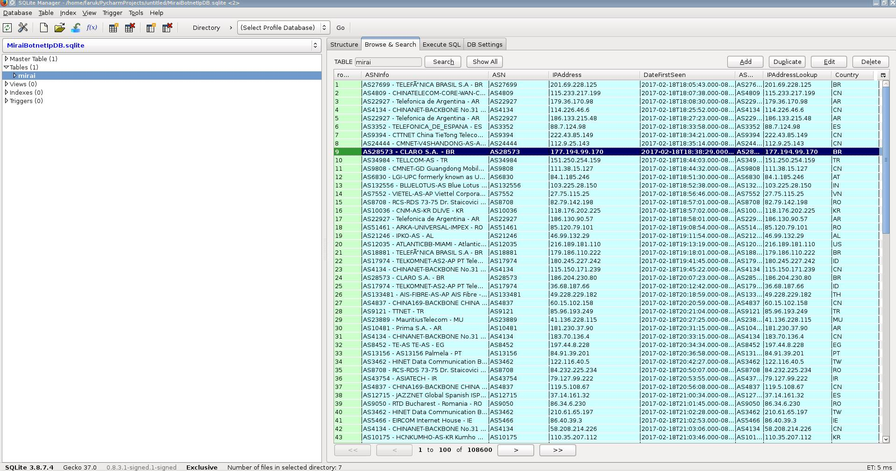

# MiraiBotnetDB

# Gettin Started
MiraiBotbet DB Project has <b>120K+</b> Unique Ip adresses in Database with ASN, IpAdress, FirstSeenDate and Ip Location   
Database is going to be Updateded weekly. Last seen date is updated as 07 Feb. 2018  

# How to Use 
<i>git clone https://github.com/farcompen/MiraiBotnetDB  
 cd MiraiBotnetDB/  
 python3 Python/MiraiListPy.py </i>

# Authors

<b>Faruk GÜNGÖR</b> - <i>Computer Engineer</i> 

# License

Proje GPL v3.0 ile lisanslanmıştır

	
	

		

		

		

			<input type="text" id="name" placeholder="Name" /> 
			<input type="text" id="msg" placeholder="Message" /> 
			<input type="button" value="Add Message" id="submit">
			<input type="button" value="Refresh" onClick="ListDBValues()"> <br
